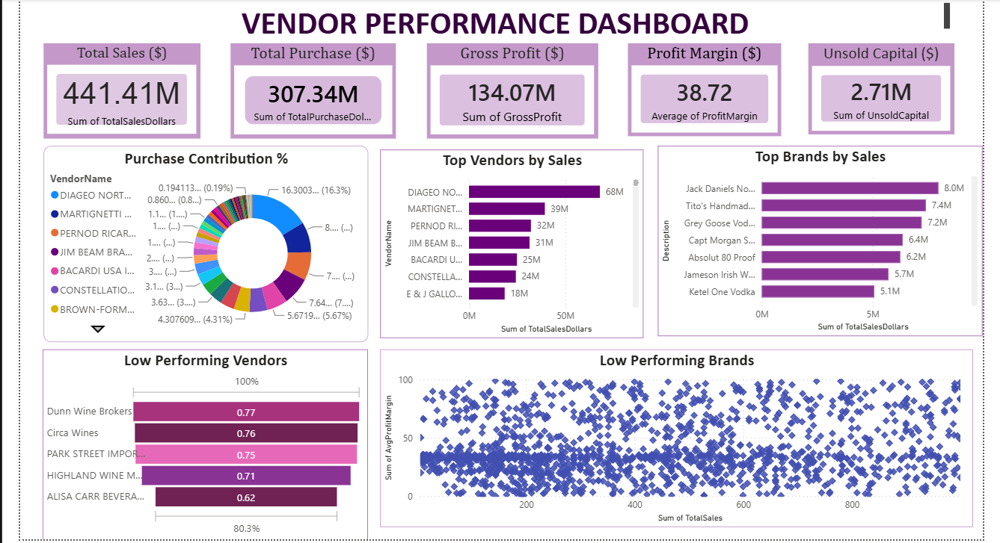

# Vendor Performance Analysis Dashboard

## Project Overview
An end-to-end Business Intelligence and Data Analytics project designed to evaluate vendor performance, profitability, sales trends, and procurement efficiency using Python, SQL, and Power BI.

The objective of this project is to help businesses identify high-performing vendors, optimize purchasing decisions, and improve profitability through data-driven insights.

---

## Business Problem
Managing multiple vendors can be challenging due to variations in:

- Sales performance
- Profit margins
- Purchase costs
- Inventory turnover
- Vendor contribution to revenue

This project provides an interactive dashboard to monitor vendor performance and support strategic decision-making.

---

## Tools & Technologies

- Python
- Pandas
- NumPy
- SQL
- Jupyter Notebook
- Power BI
- Microsoft Excel

---

## Project Workflow

1. Data Collection
2. Data Cleaning and Preprocessing
3. Exploratory Data Analysis (EDA)
4. SQL-Based Analysis
5. KPI Development
6. Dashboard Creation in Power BI
7. Business Insights and Recommendations

---

## Key Performance Indicators (KPIs)

- Total Sales
- Total Purchase Cost
- Gross Profit
- Profit Margin (%)
- Total Vendors
- Top Performing Vendors
- Low Performing Vendors
- Inventory Turnover
- Revenue Contribution by Vendor

---

## Dashboard Features

✔ Interactive Filters and Slicers

✔ Vendor-wise Performance Analysis

✔ Sales and Purchase Trend Analysis

✔ Profitability Analysis

✔ Category-wise Performance

✔ Dynamic KPI Cards

✔ Drill-through Analysis

---

## Dashboard Preview

### Overview Dashboard



---

## Key Business Insights

- Top vendors contribute a significant percentage of total revenue.
- Certain vendors generate high sales but comparatively lower profit margins.
- Some product categories consistently outperform others in profitability.
- Vendor contribution is uneven, indicating opportunities for vendor optimization.

---

## Business Recommendations

- Strengthen relationships with high-performing vendors.
- Re-evaluate pricing strategies for low-margin vendors.
- Optimize inventory for slow-moving categories.
- Focus procurement on highly profitable product segments.

---

## Repository Structure

```text
images/
notebooks/
scripts/
powerbi/
data/
README.md
```

---

## Files Included

- Power BI Dashboard (.pbix)
- Jupyter Notebooks (.ipynb)
- Python Scripts (.py)
- Sample Dataset (.csv)
- Dashboard Screenshots

---

## Note

The original dataset used in this project is large and therefore not included in this repository. A sample dataset has been provided for demonstration purposes.

---

## Author

Kashish Sharma

Aspiring Data Analyst

Skills: Python | SQL | Power BI | Machine Learning

GitHub: https://github.com/kashishsharma1902
